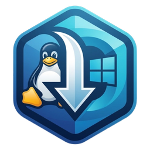
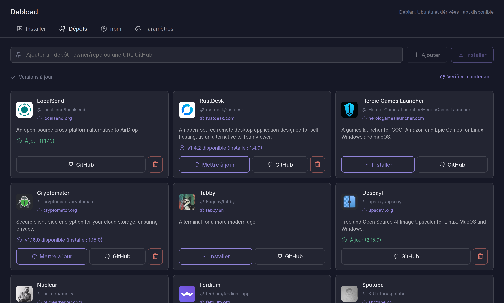
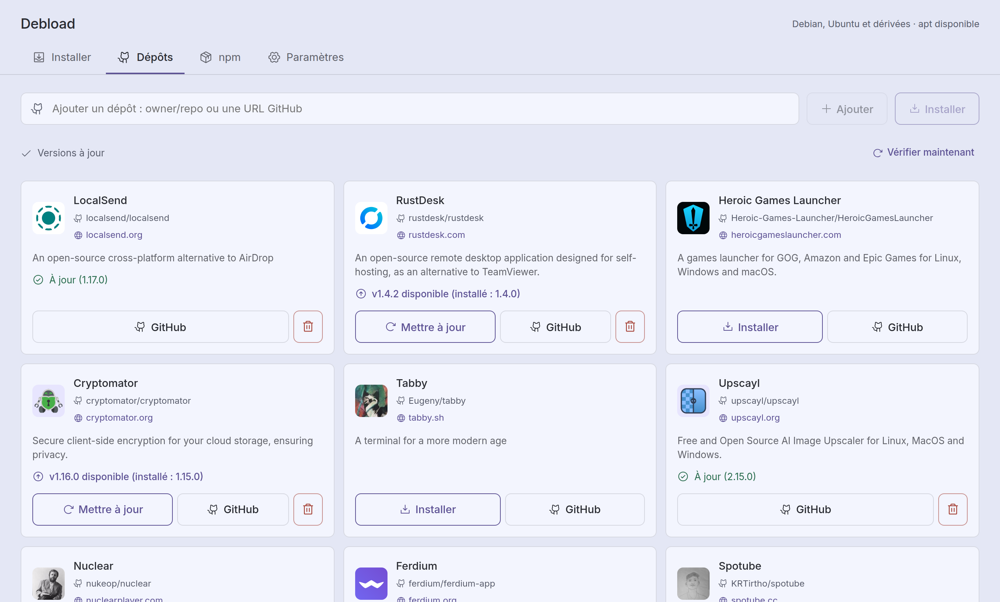
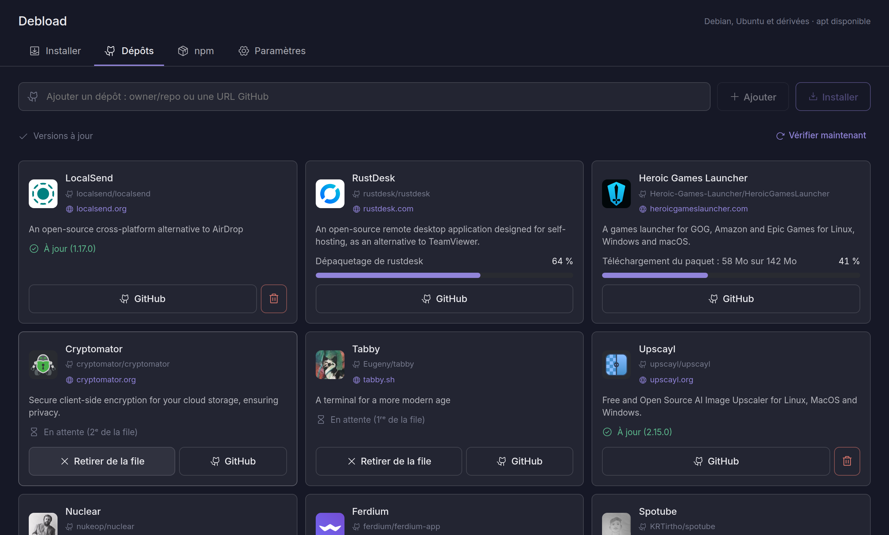
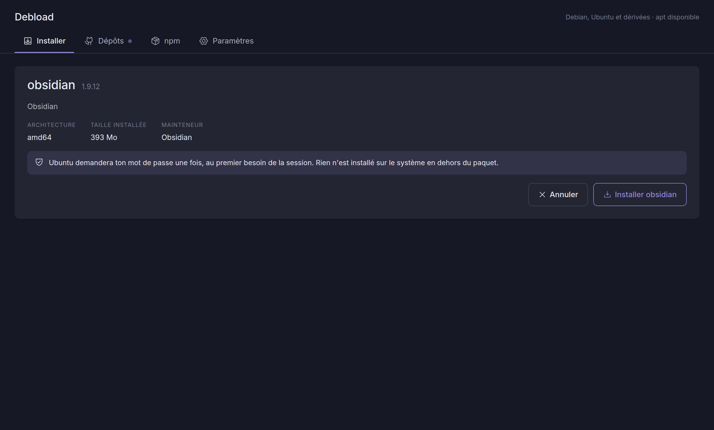
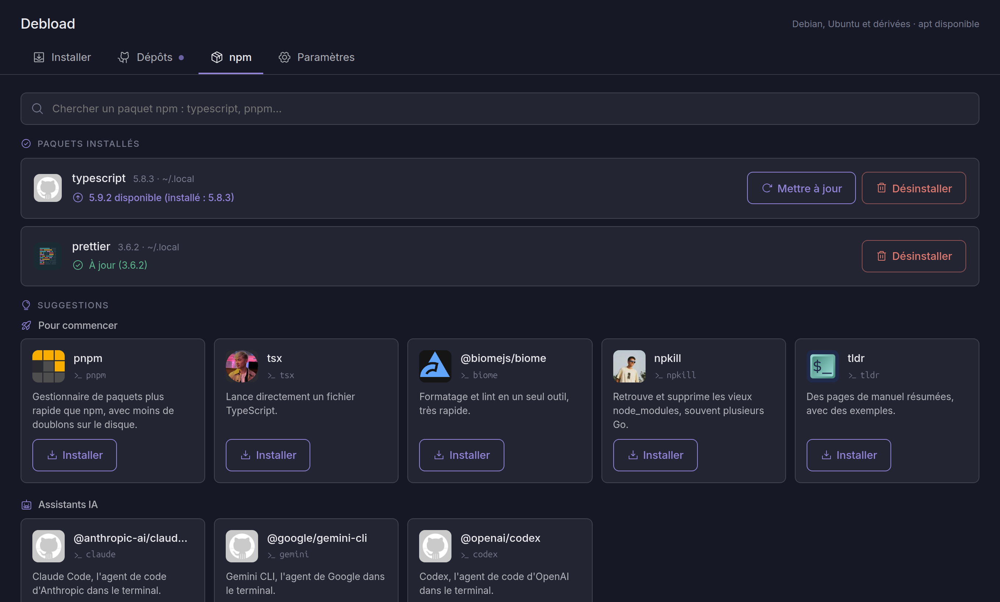
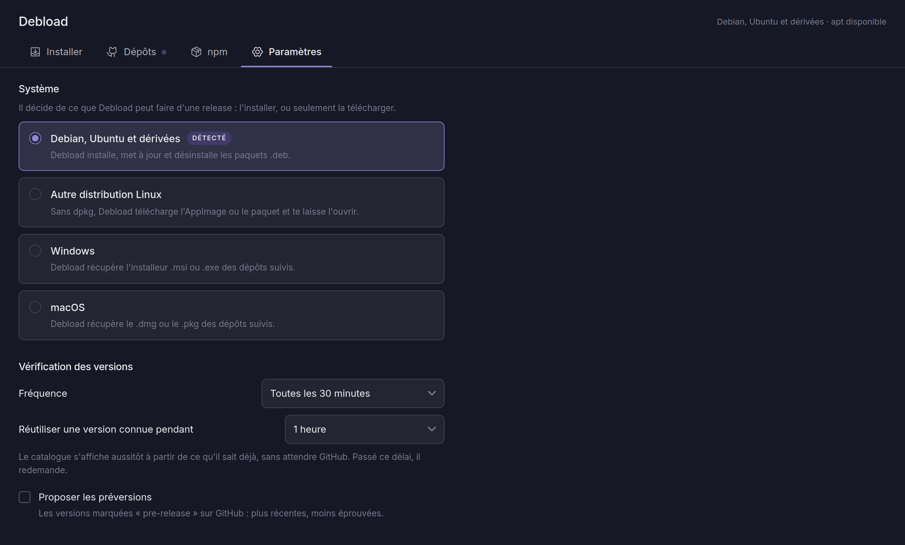

<p align="center">
  
</p>

<h1 align="center">Debload</h1>

<p align="center">
  Installe tes applications depuis GitHub et npm en un clic, et désinstalle-les aussi simplement.<br>
  Fonctionne sur Linux, Windows et macOS.
</p>

<p align="center">
  <a href="https://github.com/TISEPSE/Debload/releases/latest"></a>
  <a href="https://github.com/TISEPSE/Debload/actions/workflows/ci.yml"></a>
  <a href="LICENSE"></a>
</p>

## Captures d'écran

<p align="center">
  
</p>

Thème sombre ou clair, selon ton système :

<p align="center">
  
  
</p>

| | |
|:---:|:---:|
|  |  |
| File d'attente | Installer un `.deb` |
|  |  |
| Outils npm | Paramètres |

## Télécharger

Prends la dernière version pour ton système sur la [page des releases](https://github.com/TISEPSE/Debload/releases/latest).

| Système | Formats |
|---------|---------|
| Linux | `.deb`, `.AppImage` |
| Windows | `.exe`, `.msi` |
| macOS | `.dmg` (Apple Silicon et Intel) |

## Fonctionnalités

- Un catalogue d'applications GitHub, installées depuis leur dernière release
- Ajoute n'importe quel dépôt avec `owner/repo` ou son URL
- Prévient quand une mise à jour sort
- File d'attente : clique sur plusieurs applications, elles s'installent l'une après l'autre
- Glisse un fichier `.deb` dans la fenêtre pour l'installer
- Outils npm globaux (`typescript`, `pnpm`…), installés sans root
- Désinstallation en un clic, seulement de ce que Debload a installé
- Dépôts privés via ta session `gh`
- Thème sombre et clair

## Développement

Debload est construit avec Tauri (Rust + React).

### Prérequis

- Node.js 22 ou plus
- Rust (stable)
- Les dépendances système de Tauri ([voir la doc Tauri](https://v2.tauri.app/start/prerequisites/))

### Démarrer

```bash
git clone https://github.com/TISEPSE/Debload.git
cd Debload
npm install
npm run tauri dev
```

### Commandes utiles

```bash
npm run tauri dev           # lancer l'application
npm test                    # tests de l'interface
cd src-tauri && cargo test  # tests du backend
npm run tauri build         # construire les paquets
```

## Licence

MIT. Voir [LICENSE](LICENSE).
